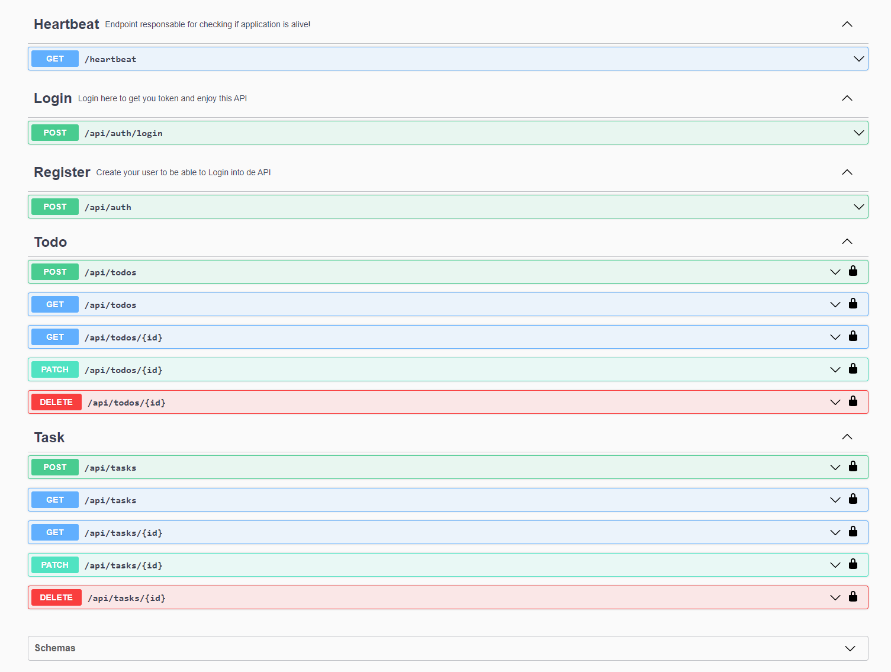

[LIVE APPLICATION ](http://jarndev.com/api/docs/)

- [x] Login with user+pass
  - [x] get a JWT token for any other request
- [x] Rest interface to CREATE, PATCH, DELETE a  TO-DO
  - [x] authenticated with JWT1
  - [x] marking them as created by the user that makes the request
  - [x] You can also add a sub-task to a given TO-DO
- [x] Rest interface to get all my  TO-DOs GET /todos
  - [x] authenticated with JWT
  - [x] returns all the TO-DOs that belong to the user that makes the request
  	
Business rules:

- [x] The name must have between 8 and 16 characters
- [x] The date of the TODO can't be Saturday or Sunday

Considerations:

- [x] Write Sequelize migrations to create models in DB
- [x] Add a docker-compose that runs the app and sets up a PostgreSQL
- [x] Ensure to write unit tests for the TO-DO business rules.
- [x] Ensure integration tests that ensure that you can only get TO-DOs that are yours.
- [x] No need to build any frontend. A working backend accessible through  Postman is enough


Runnig 
```bash
# sets up the project: CreateDB -> CreateTestDB -> Build Image -> Run Migration ->  Run Seeds -> Start Server
docker-compose up
``` 

To run Unit test that ensure busines logic:
```bash
npm run test
```

To run Integration/e2e make sure the project is not running and run:
```bash
# This command gonna create the TestDB -> Run Migrations -> Populate with Seeds -> And run tests
npm run test:e2e
```

To run migrations:
```bash
npm run db:migrate
```

To run seeds:
```bash
npm run db:seed:all
```

A Swagger openAPI interface is enabled through ``/api/docs`` route



The default login is: 

user: teste | pass: 1234

to be able to use locked routes, you will need to Login, copy the token and paste it at the Authorization section